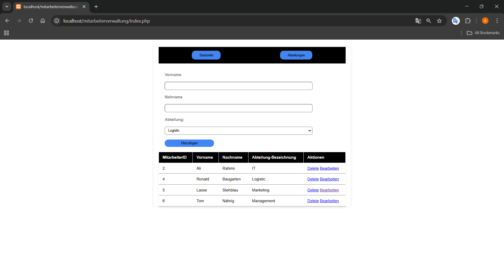
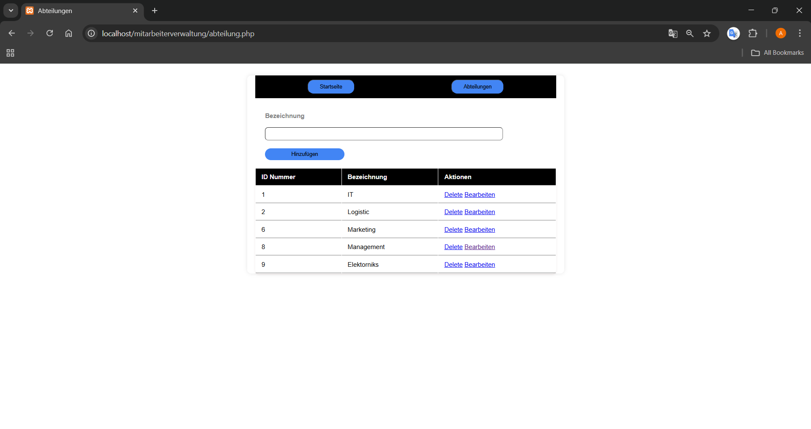
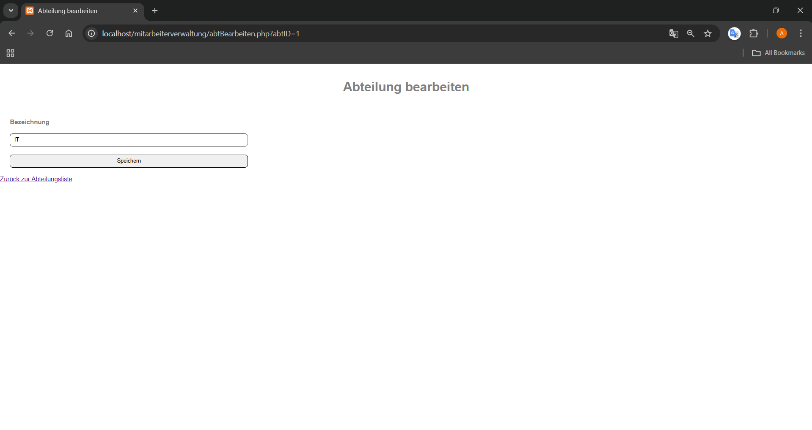
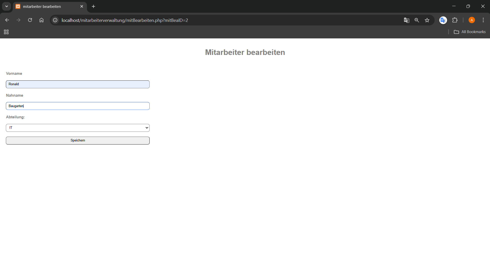

# Mitarbeiterverwaltung

Dieses Projekt ist eine einfache Mitarbeiterverwaltung mit PHP und MySQL. Es ermöglicht das Hinzufügen, Bearbeiten, Anzeigen und Löschen von Mitarbeitern über eine Weboberfläche.

## Features

- **Mitarbeiter anlegen:** Neue Mitarbeiter mit Vorname, Nachname und Abteilung hinzufügen.
- **Mitarbeiter bearbeiten:** Bestehende Mitarbeiter aktualisieren.
- **Mitarbeiter löschen:** Mitarbeiter aus der Datenbank entfernen.
- **Mitarbeiterübersicht:** Alle Mitarbeiter werden in einer Tabelle angezeigt.
- **Abteilungsauswahl:** Auswahl aus vordefinierten Abteilungen.

## Voraussetzungen

- **Webserver:** z.B. XAMPP
- **PHP:** Version 7.x oder höher
- **MySQL/MariaDB**
- **Browser:** Chrome, Firefox, Edge, Safari

## Installation

1. **Repository kopieren**
   - Lade die Dateien in dein Webserver-Verzeichnis, z.B. `htdocs` bei XAMPP.

2. **Datenbank anlegen**
   - Erstelle eine neue Datenbank mit dem Namen `mitarbeiterDB`.
   - Importiere anschließend die bereitgestellte Datei `mitarbeiterDB.sql` (z.B. mit phpMyAdmin oder über die MySQL-Konsole), um die benötigten Tabellen und Strukturen automatisch anzulegen.

3. **Konfiguration prüfen**
   - Die Zugangsdaten zur Datenbank sind in `config/db.php` hinterlegt:
     ```php
     $servername = "localhost";
     $benutzername = "root";
     $passwort = "";
     $datenbank = "mitarbeiterDB";
     ```
   - Passe sie ggf. an deine Umgebung an.

4. **Projekt starten**
   - Starte in XAMPP sowohl **Apache** als auch **MySQL**.
   - (Optional) Klicke im XAMPP Control Panel auf „Admin“ bei MySQL, um phpMyAdmin zu öffnen.
   - Dort kannst du die Datenbank `mitarbeiterDB` verwalten und die Datei `mitarbeiterDB.sql` importieren.
   - Öffne deinen Webbrowser und gib folgende Adresse in die URL-Leiste ein:  
     [http://localhost/mitarbeiterverwaltung/index.php](http://localhost/mitarbeiterverwaltung/index.php)

## Nutzung

- **Mitarbeiter hinzufügen:** Formular ausfüllen und auf „Hinzufügen“ klicken.
- **Mitarbeiter bearbeiten:** Auf das ✏️-Symbol in der Tabelle klicken, Änderungen vornehmen und speichern.
- **Mitarbeiter löschen:** Auf das 🗑️-Symbol klicken.

## Hinweise

- Die Anwendung verwendet prepared statements für sichere Datenbankabfragen.

### Vorschau

mitarbeiterHinzufuegen (`index.php`);


abteilungenHinzufuegen (`abteilung.php`);


abteilungBearbeiten (`abtBearbeiten.php`);


mitarbeiterBearbeiten (`mitBearbeiten.php`);
